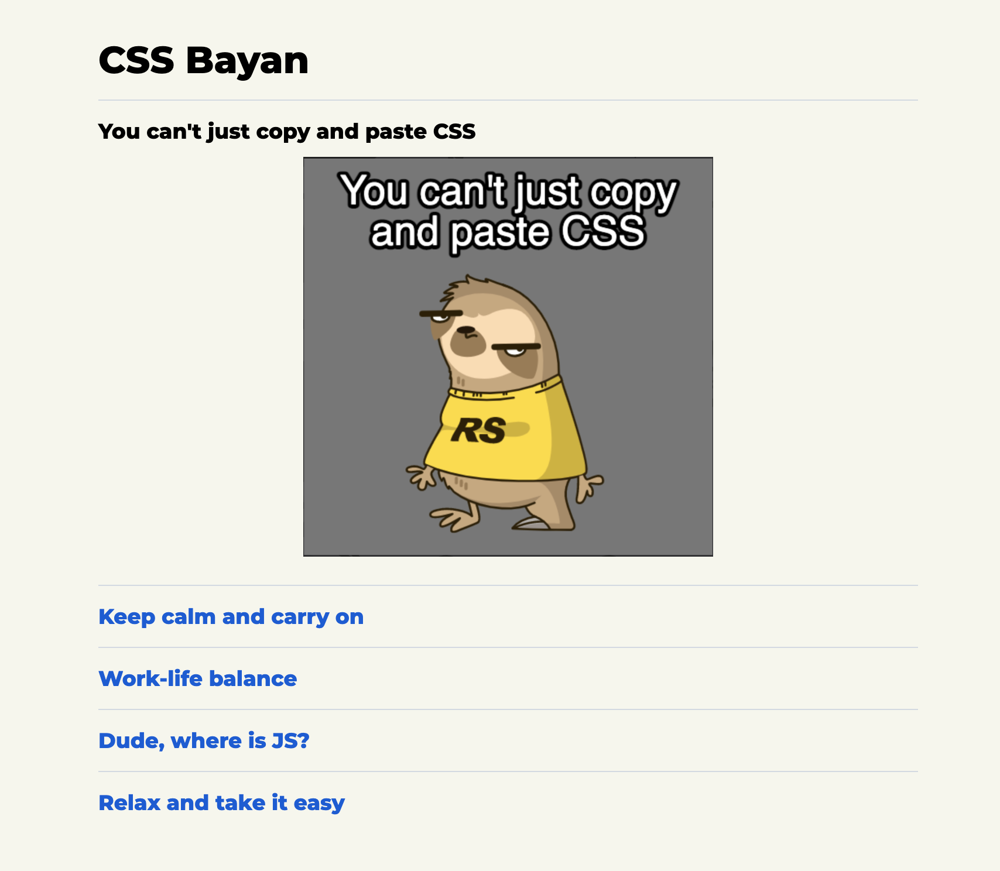
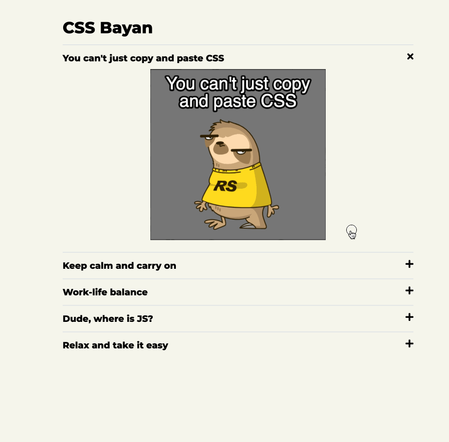
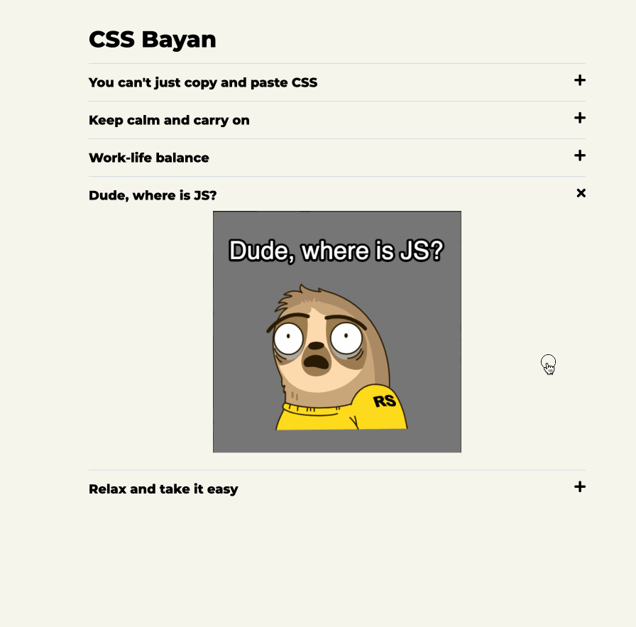

| Deadline | Folder name | Branch name |
| ----------- | ------------- | ------------- |
|  | cssBayan | gh-pages |

# Task: CSS Bayan

You should create an accordion with HTML and CSS only.

<kbd></kbd>

## Functional requirements:
- design is at your discretion, but placement of the meme text, meme image and icon is as in attached to this task image;
- there should be 3 breakpoints for mobile, tablet and desktop;
- there should be icon for emulating expanded\collapsed item (you can choose your own icons e.g. from fontawesome);
- all effects are applied (cursor is over the memes, mouse down at meme for active effect, selected meme);
- smooth transitions are applied for changing of memes and for changing of icon;
- clickable area is the whole row (text, icon and meme as well);
- cursor over the memes (hover) effect exists only for desktop devices;
- accordion is placed in the center from left and right of the screen;
- cursor should be changed while it's over the rows of the accordion;

## Clarifications - Accordion behavior:

Cursor is over the accordion:
<kbd></kbd>

Cursor is over the memes:
<kbd></kbd>

Cursor mouse down (click and set active) the meme:
<kbd></kbd>

## Repository requirements and how to submit task:
1. Create public repository `cssBayan`
2. Create `gh-pages` branch (if you don't have)
3. Switched to it (gh-pages) and create folder called `cssBayan`. Your deployed accordion will be available,
    e.g.: `https://${YOUR_GITHUB_NAME}.github.io/cssBayan/cssBayan/index.html`
4. Implement your solutions in this folder (cssBayan). There should be at least **5** commits.
5. [You should call your commits accordingly to the guideline](https://docs.rs.school/#/git-convention) + Each your commit should contain time-stamp.

    5.1. Time-stamp can be at any language; Accordingly to your time-stamp shoud be clear: when this commit was done: day of the week, month, day, year, time with seconds (the order can vary) e.g. commit message:
> init: start cssBayan-task (Mon, Sep 13, 2021 10:12:24 PM)

> feat: add basic page layout (Mon, Sep 13, 2021 10:25:24 PM)

6. When the solution is ready - open Pull Request from `gh-pages` branch to `main` branch. Pull Request name should be equal to the task name. [Description of the Pull Request should be accordingly to the guideline](https://docs.rs.school/#/pull-request-review-process?id=%D0%A2%D1%80%D0%B5%D0%B1%D0%BE%D0%B2%D0%B0%D0%BD%D0%B8%D1%8F-%D0%BA-pull-request-pr). Do NOT merge this Pull Request. The link to this Pull Request should be submitted to the cross check form. Pull request should contain full full - what was done and what was skipped. Your should describe all breakpoints for your accordion.e.g.: `mobile 320x568, tablet 820x1180, desktop 1920×1080`.

❗ Remember that if cross-checker has any potential questions to your accordion solution - he\she should find all the answers in the pull request description.

## How to check the task:

- The task will be checked with peers cross-check. [Cross-check instructions](https://docs.rs.school/#/cross-check-flow)

## Technical requirements:
- It's forbidden to use CSS frameworks (bootstrap, foundation и т.д.);
- It's forbidden to use JavaScript and npm libraries;
- It's forbidden to use CSS preprocess tools (You should use pure CSS);
- Your accordion should work correctly in Chrome;
- It's allowed to use additional content e.g. h1, footer, header,... to increase content of the page;
- It's allowed to use `gif` images;
- It's allowed to use `px` for media queries;
- It's allowed to have automatic first commit, which is called `Initial commit` and created by Git Hub;
- It's allowed to use `reset.css` and `normalize.css`

## Criteria for estimation\evaluation

**Max score 130**

1. Everything is done from `Repository requirements and how to submit task` section **+30**
2. Accordion is placed in the center from left and right **+10**
3. Icons, meme texts and meme images are exist **+5**
4. Placement of the meme, icons and meme text are the same as in task **+5**
5. Smooth change (transition) of the meme images and icons **+20**
6. Three breakpoints for mobile, tablet and desktop exist **+10**
7. All effects are applied (cursor is over the memes, mouse down at meme for active effect, selected meme) **+10**
8. Clickable area is the whole row (text, icon and meme image as well) **+5**
9. Cursor over the memes (hover) effect exists only for desktop devices **+10**
10. Cursor should be changed while it's over the rows of the accordion **+5**
11. Only flexible dimensions are used `rem, em, %, vh, vw, fr` and etc... The accordion is rubber **+10**
12. All blocks/parts of the accordion are in base flow of the dom elements. They are not positioned with `top, left, right, bottom`; `float` is not used. It's allowed to use: `flex, grid, margin-left` and etc... - everything that not mentions above. The value of `position` is only `static` **+5**
13. Pseudo-elements are not used (not to be confused with another concept pseudo-classes - Pseudo-classes are not forbidden). **+5**

## Penalty points/Fine:
- Usage of the JS scripts or any other libraries **-100500**
- Usage of the apfruscated (not human-readable) CSS/HTML **-100500**
- Cheating, peer copy pasting **-100500**

❗ Sizes of the each block, fonts, content and design are up to developer. Differences can vary significantly. The score do not downgrade for that. The main goal to save positions and behavior of the accordion and the other technical requirements.

❗ Recommended breakpoints for the application are: `mobile 320x568, tablet 820x1180, desktop 1920×1080`, but the developers can assign their own breakpoints, which should be provided in the Pull Request description. The only rule - mobile resolution should be mobile, tablet resolution should be tablet and desktop resolution should be desktop. e.g. `mobile 1850x1000, tablet 1900x1050, desktop 1920×1080` - is incorrect.

❗ Feel free to create/find/choose memes by your own, but preferably at least 4 memes.

Good luck in creation of your own BAYAN =)
